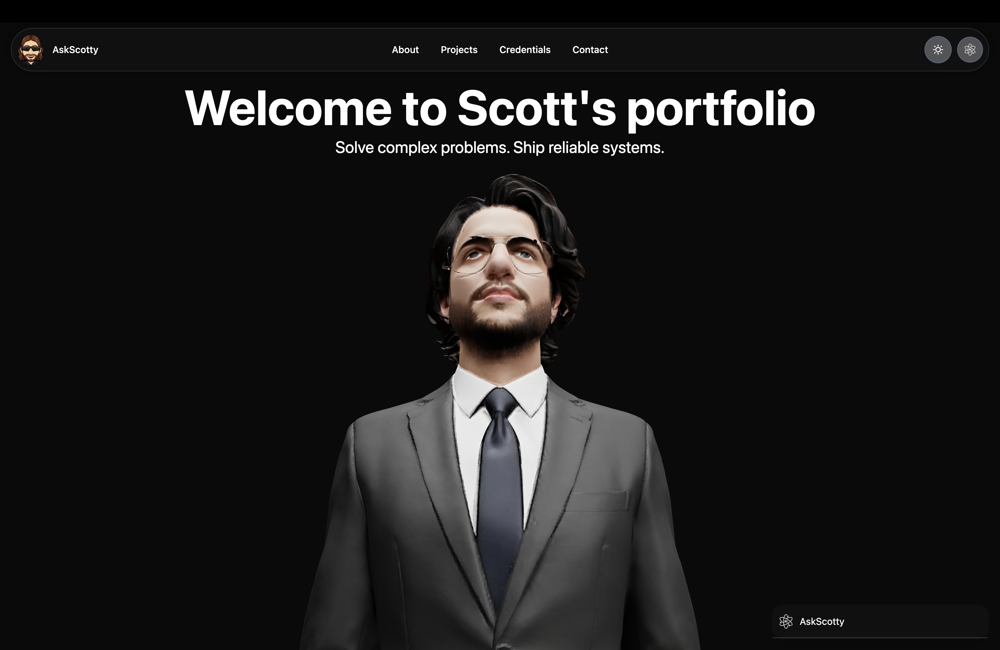

# Welcome to Scott's portfolio

## 📸 Preview

<p align="center">
  
</p>


## Project Structure

This portfolio uses the Next.js App Router. Below is an overview of the main folders and files in the `app/` directory:

```
app/
	globals.css                # Global styles
	layout.tsx                 # Root layout for all pages
	page.tsx                   # Homepage
	RootLayoutClient.tsx       # Client-side root layout logic
	about/                     # About page and related components
		HeroModel/               # 3D hero model components
		TileHighlightSection/    # Highlight section for About
	api/                       # API routes (e.g., askscotty)
	components/                # Reusable UI components
		AskScottyWrapper.tsx     # Wrapper for AskScotty feature
		ChatLayoutWrapper.tsx    # Chat layout
		LenisProvider.tsx        # Smooth scrolling provider
		PageContent.tsx          # Main page content wrapper
		AskScotty/               # AskScotty feature components
		DarkModeToggle/          # Dark mode toggle button
		Footer/                  # Footer component
		Navbar/                  # Navigation bar
		ScottModel/              # 3D Scott model components
	contact/                   # Contact page and styles
	context/                   # React context providers
		AskScottyContext.tsx     # Context for AskScotty
		LoadingContext.tsx       # Loading state context
	credentials/               # Credentials page
	home/                      # Home page sections and styles
		impactsection/           # Impact section
		showcase/                # Project showcase
		showcase-sm/             # Small screen showcase
		text/                    # Text sections and styles
	projects/                  # Projects page
	test/                      # Test pages and components
```

### Key Features & Sections

- **Homepage**: `app/page.tsx` is the main landing page.
- **About**: `app/about/` contains the about page and hero model components.
- **Projects**: `app/projects/page.tsx` lists your projects.
- **Contact**: `app/contact/page.tsx` provides a contact form or info.
- **AskScotty**: Interactive feature for Q&A, with context and API route.
- **3D Models**: Components for rendering 3D models (Scott, Hero) in various styles.
- **Dark Mode**: Toggle available via `components/DarkModeToggle/`.
- **Reusable Components**: Navbar, Footer, wrappers, and more in `components/`.
- **Context Providers**: For managing state and features like AskScotty and loading.

### Customization

- Update your personal info, projects, and sections by editing the relevant files in `app/`.
- Add or modify components in `app/components/` for new features or UI changes.
- Adjust styles in `globals.css` and other CSS files.

---

# My Portfolio Website

This is a personal portfolio website built with [Next.js](https://nextjs.org), designed to showcase my projects, skills, and experience. The site is fully responsive and easy to customize for your own use.

yarn dev

## Getting Started

To run the project locally:

```bash
npm install
npm run dev
```

Then open [http://localhost:3000](http://localhost:3000) in your browser.

You can customize the content by editing files in the `app/` directory, especially `app/page.tsx` for the homepage.

Fonts are optimized using [`next/font`](https://nextjs.org/docs/app/building-your-application/optimizing/fonts) and [Geist](https://vercel.com/font).


## Features

- Modern, responsive design
- Project showcase section
- Skills and experience highlights
- Contact form or contact information
- Easy to customize

## Customization

Update your personal information, projects, and skills by editing the relevant files in the `app/` directory. You can also change styles and layout by modifying components in `app/components/` (if available).

## Deployment

Deploy your portfolio easily on [Vercel](https://vercel.com/) or any platform that supports Next.js. See the [Next.js deployment documentation](https://nextjs.org/docs/app/building-your-application/deploying) for more details.


## Contact

Feel free to reach out via the contact section on the website or by email (update with your email address).

---

Built with ❤️ using Next.js.
